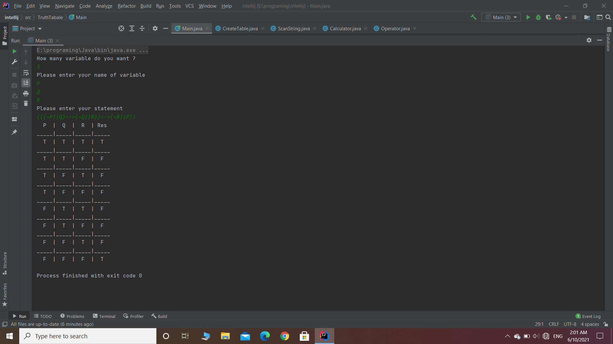
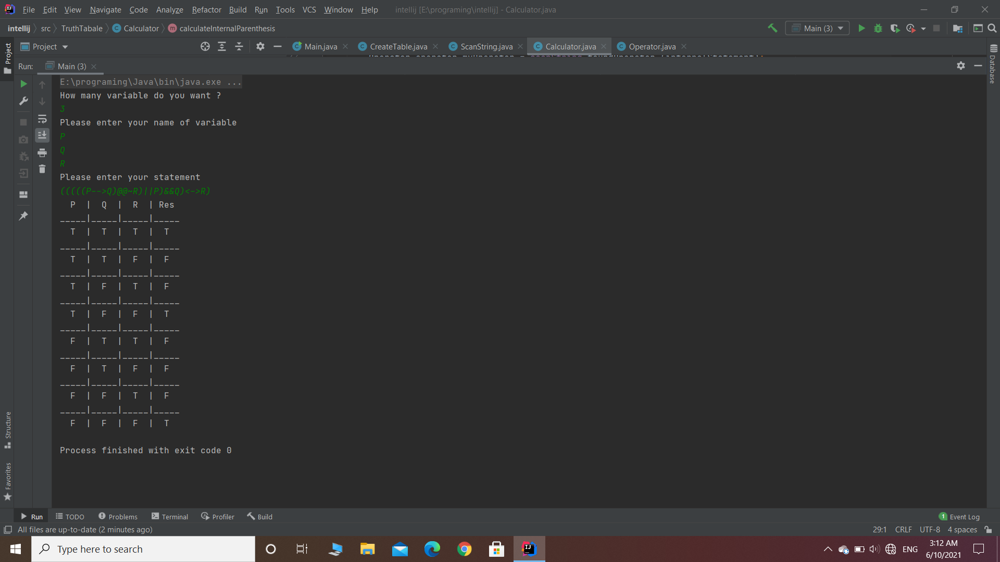
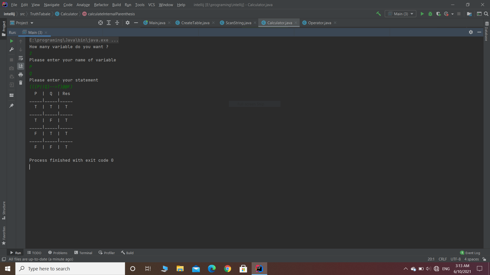
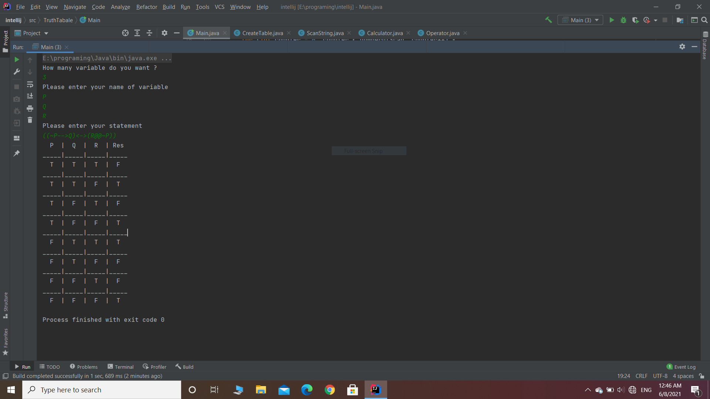
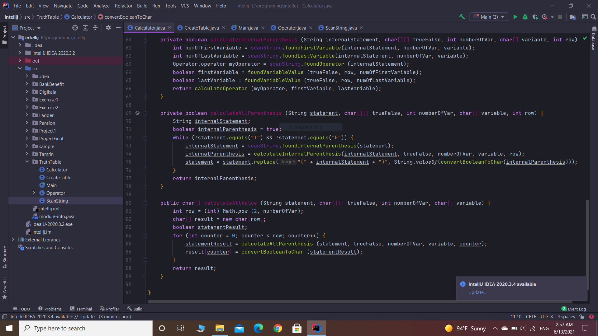

# Truth-table
A truth table project from black assassin coder;
Program with Java;
311 Lines of codes;
Have 5 class and one enum class;
No warnings;
No Errors;
True false statement suport;
Works with parenthesis;

